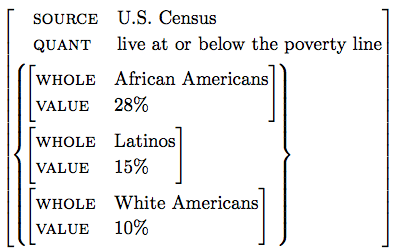
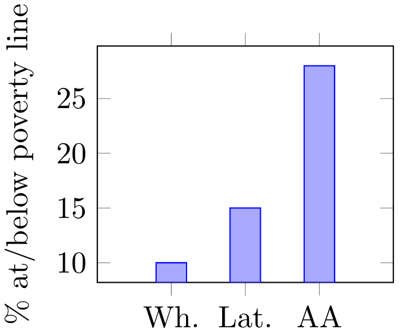
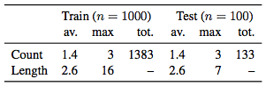
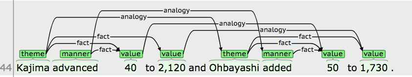

# Textual Analogy Parsing

Textual Analogy Parsing (TAP) is the task of identifying analogy frames from text. Analogy frames are a discourse-aware shallow semantic representation that highlights points of similarity and difference between analogous facts. 

Given the following sentence

> According to the U.S. Census, almost 10.9 million African Americans, or 28%, live at or below the poverty line, compared with 15% of Latinos and approximately 10% of White Americans.
 
a TAP parser outputs the following analogy frame:

 

TAP frames can be used to automatically plot quantitative facts. The following was generated by assigning elements of the *compared content* from the above frame (in the curly brackets) to the x- and y- axes of a plot, and assigning elements of the *shared content* (in the outer-tier of the frame) to scopal plot elements like titles and axis labels:

 

## Dataset

We report experiments in the paper on a hand-annotated dataset of quantitative analogy frames identified in the Penn Treebank WSJ Corpus. 

Some statistics: 

 

Here, *Count* refers to the number of frames and *Length* refers to the number of values compared within a given frame. *Av(erage)* is the per-sentence average over a given dataset and *max(imum)* is the maximum over all sentences. *Tot(al)* is the total number of frames in a given dataset.

The `data/` folder contains four files: `train.xml` and `test.xml` are human-readable versions of the train and test sets; `train.json` and `test.json` are easy-to-load versions.

## Reproducing results
You can reproduce our results using our published models (located in `models/`) by simply running `make` in the `src/` folder.
The provided Makefile will take care of creating a virtual environment and getting any necessary resources like pretrained Glove vectors and the Gurobi optimizer.
Note however that you will still have to manually obtain a Gurobi license from [here](http://www.gurobi.com/downloads/licenses/license-center).
Our code _requires_ Python 3.6.

In particular, running `make .results` will generate the results reported in the paper: for example, the files `results/neural_all.predictions.jsonl` and `results/neural_all.score` contain the predictions and evaluation scores respectively for the Neural model with all features and using greedy decoding on the test set.
Likewise, `results/neural_all.ilp.predictions.jsonl` and `results/neural_all.ilp.score` contain the predictions and evaluation scores when using optimal decoding.
The predictions and results generated on the training set during cross-validation can be found in `/models/neural_all/predictions.json` and `/models/neural_all/predictions.score` respectively.

As an example, `results/neural_all.score` should produce the following table in CSV:

|metric                   |p    |r    |f1
|-------------------------|-----|-----|-----
|decoded_span_edge        |0.549|0.573|0.561
|decoded_span_edge_nomatch|0.489|0.511|0.500
|decoded_span_node        |0.384|0.651|0.483
|span_edge                |0.748|0.704|0.725
|span_edge_nomatch        |0.647|0.609|0.627
|span_node                |0.392|0.781|0.522
|span_node_nomatch        |0.378|0.689|0.489
|token_edge               |0.773|0.654|0.709
|token_node               |0.686|0.694|0.690

The three important metrics are as follows:
the `decoded_span_edge` scores correspond to the frame prediction scores reported Table 3 of the paper,
the `span_node` scores correspond to the span prediction scores reported in Table 4 and
the `span_edge` scores correspond to the edge prediction scores reported in Table 5.
Note that the scores reported in Table 3 are on the test set, while Table 4 and Table 5 are on output generated during cross-validated training.

If you wish to retrain a model or reproduce these results, simply remove the corresponding files (e.g. the directory `/models/neural_all`) and run `make`.

A legend of the different models that are built are as follows:
* `logistic_all`: A log-linear CRF model.
* `neural_none`: A neural CRF model without any features.
* `neural_all`: A neural CRF model with all of the features.
* `neural_wo_ner`: The `neural_all` model, except without any NER features.
* `neural_wo_dep`: The `neural_all` model, except without any dependency path features (including the PathMax features).
* `neural_wo_crf`: The `neural_all` model, except without the CRF decoder.

## Visualizing the output
We also provide a utility that converts any output `.jsonl` file to the [brat standoff format](http://brat.nlplab.org/standoff.html). This allows for a pleasant visualization of the output, e.g.:

 

To use, simply run the command `python convert.py graph2standoff -i <predictions.jsonl> -o <prefix>`. The command will generate a `<prefix>.txt` and `<prefix>.ann` file that can be visualized by [brat annotation tool](http://brat.nlplab.org/).

## Citing Us
If you use our data, or use our models for building on TAP or a related task, please be sure to cite the most recent version of our paper from EMNLP 2018.

`@inproceedings{lamm2018analogies,
 author = {Lamm, Matthew and Chaganty, Arun Tejasvi and Manning, Chrisopher D. and Jurafsky, Dan and Liang, Percy},
 booktitle = {Empirical Methods in Natural Language Processing},
 location = {Brussels},
 title = {Textual Analogy Parsing: What's Shared and What's Compared among Analogous Facts},
 url = {https://nlp.stanford.edu/pubs/lamm2018analogies.pdf},
 year = {2018}
}`

